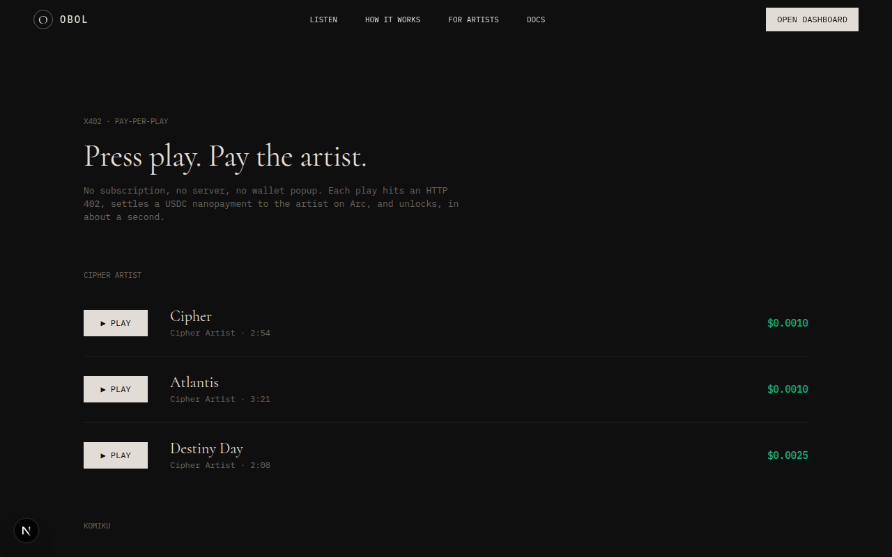
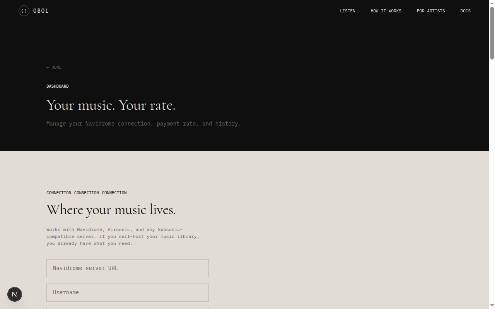
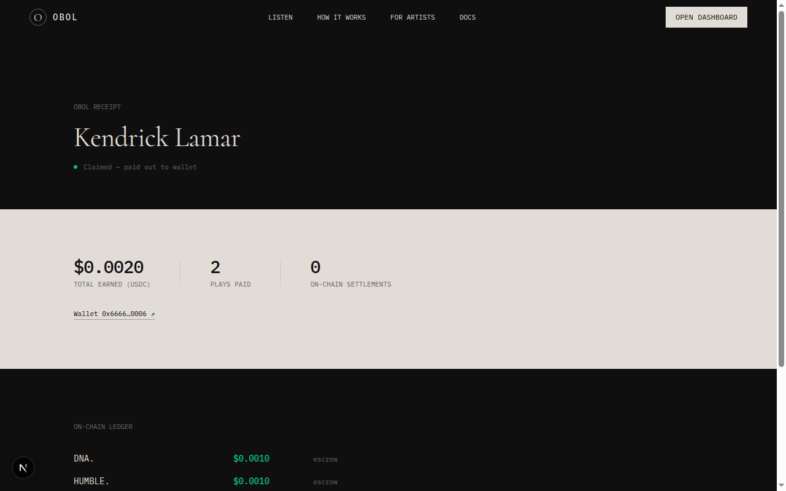
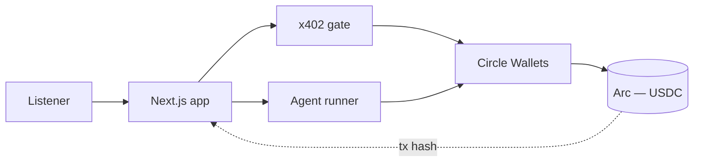

<div align="center">

# Obol

### Every listen pays the artist. Automatically. On-chain.

Obol turns listening into income for musicians, one play at a time, settled in USDC with no subscriptions, no middlemen, and no waiting for a quarterly payout.

[](https://github.com/mystiquemide/obol/actions/workflows/ci.yml)
[](./LICENSE)


</div>

---

## The problem

Streaming pays artists fractions of a cent, months after the fact, after platforms take their cut. People who own their music libraries pay artists nothing at all after the initial purchase. There has never been a lightweight way to pay an artist directly, the moment you actually listen.

## The solution

Obol pays artists per listen, in real time, on-chain. It works two ways:

- **For anyone — pay-per-play (x402).** Press play. An HTTP `402 Payment Required` gate settles a USDC nanopayment to the artist on Arc, and the track unlocks, in about a second. No server, no subscription, no wallet popup.
- **For self-hosted libraries — the agent.** Connect a music server and an autonomous agent watches what you play, identifies the artist (using an LLM to resolve ambiguous matches), and settles a USDC payment per listen. Unclaimed artists accrue earnings in escrow until they claim a wallet.

Every payment, both paths, produces a real on-chain transaction you can click and verify.

> **Live demo:** _coming soon_ — deploy in progress.
>
> <!-- Replace with a 30–60s screen recording of /listen: press play → 402 → settle on Arc → unlock → music, then click the tx hash. -->
> _Demo recording to be added (`docs/assets/demo.gif`)._

## Features

- **x402 payment gate** — real HTTP 402 flow, settled on Arc via Circle, verified by on-chain tx hash
- **Autonomous payment agent** — scrobble → artist resolution → USDC settlement, fully streamed live
- **LLM artist disambiguation** — picks the real performer when identity is ambiguous, and shows its reasoning
- **Artist escrow, claim, and self-onboarding** — list your tracks, set a price, get paid to your wallet
- **Public on-chain receipts** — a shareable page per artist with a verifiable payment ledger
- **Spend controls** — per-listen rate, daily spend cap, and rate-limited public endpoints
- **Production-ready** — health check, error boundaries, CI, CodeQL, Docker, mobile-responsive, accessible

## Screens

<!--
Capture these from the running app and save into docs/assets/ :
  1. listen.png    — /listen mid-handshake: 402 → settle → unlocked with the audio control
  2. dashboard.png — /dashboard agent run with the streamed log + climbing stats
  3. receipt.png   — /artist/[mbId] receipt showing the on-chain ledger of tx links
-->

| Pay-per-play | Agent dashboard | On-chain receipt |
|---|---|---|
|  |  |  |

## Tech stack

- **Next.js 16** (App Router), TypeScript, Tailwind
- **Prisma 5** + **Postgres** (Neon)
- **Circle Developer Controlled Wallets** + **Arc** (USDC settlement)
- **Groq** (Llama 3.3 70B) for artist disambiguation, with an Anthropic fallback
- **MusicBrainz** for artist identity, **Subsonic/Navidrome** for listening data
- Server-Sent Events for live agent and payment streaming

## Architecture



Full system, sequence, and trust-boundary diagrams are in [docs/ARCHITECTURE.md](./docs/ARCHITECTURE.md).

## Quick start

```bash
npm install
cp .env.example .env          # fill in the values
npx prisma db push            # sync schema to your database
node scripts/gen-audio.mjs    # generate sample audio for the catalog
node scripts/seed-tracks.mjs  # seed the catalog (after artists exist)
npm run dev                   # http://localhost:3000
```

You'll need a free [Neon](https://neon.tech) Postgres database, a free [Groq](https://console.groq.com) key, and [Circle](https://console.circle.com) sandbox credentials. A music server is optional, the agent falls back to sample tracks.

## Environment

All configuration is via environment variables. See [`.env.example`](./.env.example) for the full list and [docs/DEPLOYMENT.md](./docs/DEPLOYMENT.md) for descriptions.

## Scripts

| Command | Description |
|---|---|
| `npm run dev` | Start the dev server |
| `npm run build` | Production build |
| `npm start` | Run the production build |
| `npm run lint` | ESLint |
| `npm run typecheck` | TypeScript, no emit |
| `npm test` | Unit tests (Vitest) |
| `npm run format` | Prettier |

## Verification status

Type-checked and built in CI on every push. Core payment logic is unit-tested, and end-to-end settlement is verified against Arc with real on-chain transactions. Audio in the catalog is sample audio; production catalogs would use licensed recordings.

## Deployment

Deploys to Vercel with Postgres on Neon, or runs via Docker. See [docs/DEPLOYMENT.md](./docs/DEPLOYMENT.md).

## Roadmap

- Mainnet settlement after a security review
- Last.fm / scrobble import as an entry point beyond self-hosted servers
- Durable, multi-instance rate limiting
- Encrypted music-server credentials at rest
- Deeper integration test coverage

## Limitations

- Settlement currently runs on Arc Testnet
- Catalog audio is sample audio, not licensed recordings
- The x402 gate settles via Circle on Arc and verifies by tx hash, rather than the EIP-3009 facilitator scheme

## Contributing

Contributions are welcome — see [CONTRIBUTING.md](./CONTRIBUTING.md) and the [Code of Conduct](./CODE_OF_CONDUCT.md).

## Security

Found a vulnerability? See [SECURITY.md](./SECURITY.md). Please don't open public issues for security reports.

## License

[MIT](./LICENSE) © MystiqueMide

## Maintainer

Built and maintained by **MystiqueMide** — splashmediahub@gmail.com
