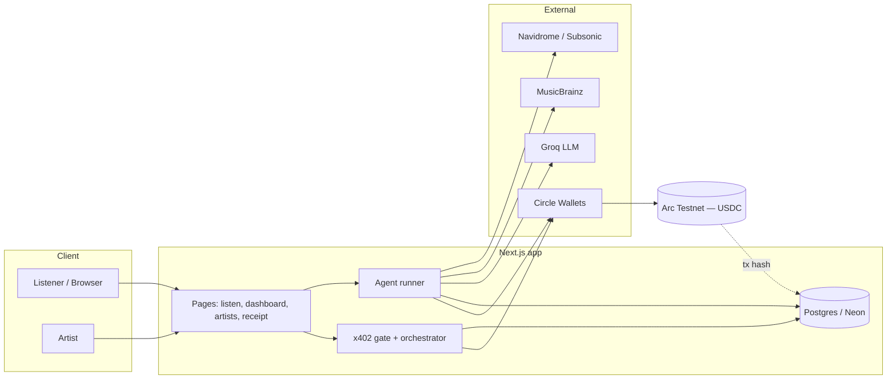
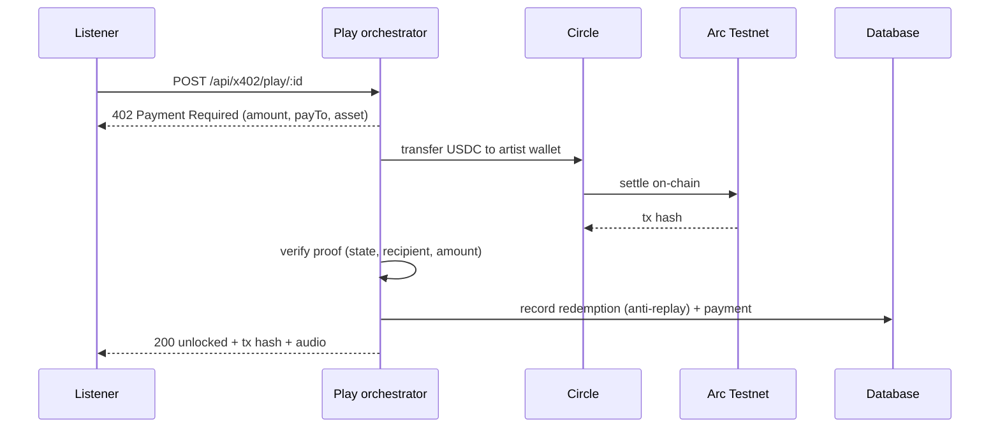
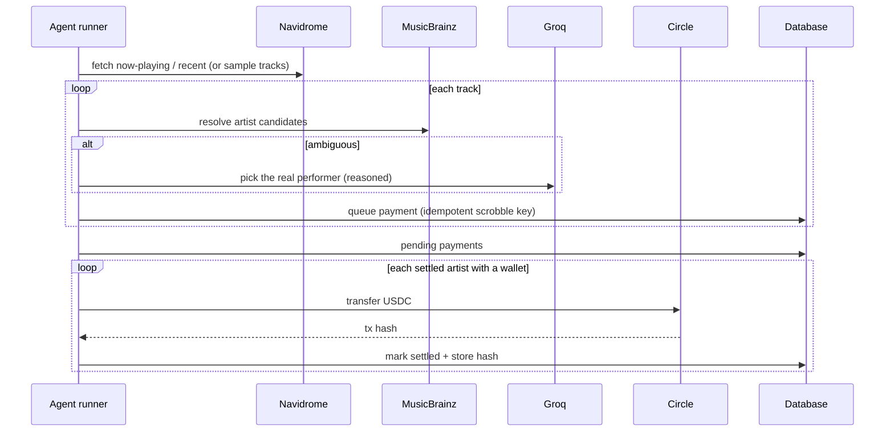

# Architecture

Obol turns a listen into a payment. It does this two ways: an autonomous agent that
watches a listening history and pays per scrobble, and an x402 pay-per-play gate that
charges at the moment a track is played. Both settle USDC on Arc through Circle and
record an on-chain transaction hash.

## System

## x402 pay-per-play

The gate (`/api/x402/track/[id]`) is a real HTTP 402 endpoint. The orchestrator
(`/api/x402/play/[id]`) runs the same payment-requirements and verification logic
in-process, so it works behind tunnels and on serverless without a self-fetch.

## Agent settle loop

## Roles and boundaries

- **App layer (Next.js).** Orchestration, payment requirements, on-chain verification,
  catalog, escrow accounting. Holds no private keys.
- **Circle.** Custodies developer-controlled wallets and signs transactions server-side.
- **Arc Testnet.** Final settlement and the source of truth for proof (tx hash).
- **External reads.** MusicBrainz (identity), Groq (disambiguation), Navidrome (listening
  data). None of these move funds.

Unclaimed artists accrue earnings in escrow against their MusicBrainz ID; on-chain
transfer happens once they claim or onboard a wallet.

## Key design decisions

- **In-process x402 verification.** The orchestrator does not HTTP-fetch its own gate;
  it reuses the gate's logic directly. This avoids loopback failures behind tunnels and
  on serverless while keeping the gate a real external 402 endpoint.
- **Idempotent payments.** Each scrobble has a stable key, so re-running the agent never
  double-pays the same play.
- **Spend caps + rate limits.** Public play and run endpoints are throttled per client
  and bounded by a daily spend cap.
- **Cold-start resilience.** Database calls retry through serverless-Postgres cold starts.
- **Pluggable LLM.** Disambiguation runs on Groq by default, with an Anthropic fallback,
  behind a single provider abstraction.
